# Goal System

The goal system is the request-local execution graph for operations that need
to walk Nix derived paths. It exists to keep dependency walking, substitution,
build scheduling, result aggregation, and client log subscription wiring in one
place without making the global scheduler understand every request shape.

The architecture is intentionally split:

- `GoalEngine` is a fresh registry for one daemon request.
- `Goal` is the base lifecycle primitive. The first waiter starts `_run()`;
  later waiters share the same task.
- `GoalHolder` runs child goals serially. It is used where the next step depends
  on the previous result, such as nested derived paths.
- `ExecutionGoal` runs child goals in parallel and preserves result order.
- The scheduler remains the cross-request work scheduler. It deduplicates
  actual builds by `.drv` path and owns build log subscribers.
- `SubstitutionQueue` remains the cross-request substitution lane. It caches
  availability, tracks substituter health, selects the best substituter, and
  deduplicates active imports by store path.

This means the goal graph can be request-local and easy to reason about while
slow side effects are still deduplicated globally at the operation that matters.

## Entrypoints

`GoalEngine` exposes the request entrypoints:

- `build_paths()` converts the Nix `BuildPaths` success/failure integer into a
  `BuildPathsWithResults` goal run.
- `build_paths_with_results()` creates a `BuildPathsWithResultsGoal`.
- `query_missing()` creates a `QueryMissingPlanGoal`.

Only `BuildMode.NORMAL` is supported for goal-driven builds right now. Other
modes fail early with a clear error.

## Mutating Build Flow

`BuildPathsWithResultsGoal` is the mutating root for `BuildPaths` and
`BuildPathsWithResults`.

For each requested wire `DerivedPath`, it asks the `GoalEngine` for an
`EnsureDerivedPathGoal`. Those root ensure goals run in parallel and produce
keyed build results.

`EnsureDerivedPathGoal` decides how to realise a path:

- Opaque store path: return success if it is already valid locally, otherwise
  try substitution, otherwise return an `UNKNOWN` failure.
- Nested derived path: realise the outer path first, then wrap the produced
  inner `.drv` and continue serially.
- Flat derivation: parse the `.drv`, check requested outputs, try substituting
  known outputs, realise missing input derivations, resolve dynamic placeholders
  when needed, try substitution again on resolved outputs, then build.

`BuildDerivationGoal` is the boundary between the goal graph and the scheduler.
It submits one `BuildDerivationRequest` with `from_goal_path=True`, subscribes
client log consumers to the queued build, awaits the scheduler future, registers
returned realisations when appropriate, and converts scheduler output into a
`GoalResult`.

`SubstitutePathGoal` is the boundary between the goal graph and the substitution
lane. It asks `SubstitutionQueue.get_substituter(path)` for the selected source,
recursively substitutes referenced paths through child `SubstitutePathGoal`s,
then asks `SubstitutionQueue.substitute(path)` to perform the deduplicated
import.

## Read-Only QueryMissing Flow

`QueryMissingPlanGoal` is separate from the mutating ensure path. It updates
substitution availability caches, but it must not build paths or import store
objects.

It classifies requested roots in parallel:

- Valid local output: no report entry.
- Missing output with substituter availability: `will_substitute`.
- Missing output without substituter availability: `will_build` for derivation
  outputs, `unknown` for opaque paths.
- Dynamic or nested derivation: `will_build`, matching current Nix behavior.
- Missing `.drv`: `unknown`.

This separate read-only path intentionally duplicates a little traversal logic
from the mutating path. Keeping read-only and mutating semantics separate is
more important than forcing all behavior through one generic walker.

## Deduplication Boundaries

Goal deduplication is request-local only. `GoalEngine` keys goals inside one
request so two branches that need the same path share the same goal task.

Global deduplication lives below the goal system:

- Build deduplication: `BuildQueue` / scheduler, keyed by `.drv` path.
- Substitution import deduplication: `SubstitutionQueue`, keyed by store path.
- Substitution availability caching: `SubstitutionQueue`, keyed by store path
  and substituter store id.

Do not add cross-client goal deduplication unless the ownership and cancellation
rules are redesigned. It makes subscribers, disconnects, failure policy, and
request-local result semantics much harder to reason about.

## Result Model

Mutating goals return `GoalResult`:

- `result`: the wire `BuildResult`.
- `resolved_outputs`: output name to store path mappings used by parent goals.
- `produced_paths`: store paths produced or made available by this goal.
- `dynamic_paths`: mappings used to resolve dynamic derivations.

Parent goals should copy child results before adding metadata. A child result
may be shared through request-local deduplication, so mutating it in place can
leak state between branches.

`QueryMissingPlanGoal` does not use `GoalResult`; it produces a
`QueryMissingResponse` directly.

## Error And Continue Semantics

Expected build, substitution, or planning failures should normally be returned
as failure `BuildResult`s, not raised exceptions. This lets sibling root goals
continue and lets `BuildPathsWithResults` report one keyed result per requested
root.

Unexpected exceptions still fail the enclosing task group. That is acceptable
for programming errors or infrastructure failures where continuing would hide
corruption.

## Client Subscriptions

The goal graph does not stream build logs itself. It forwards client
subscriptions to the scheduler once a `BuildDerivationGoal` has a build id.

`BuildDerivationGoal` tracks the subscriptions it creates and unsubscribes them
when its scheduler future completes. The scheduler uses its subscriber reference
counts to cancel client-bound builds when all explicit subscribers are gone.

Passive detection of silent client disconnects while a request is blocked
waiting for a build is deliberately deferred.

## Graphviz Sketch

This is the current conceptual graph. Solid edges are goal-to-goal execution.
Dashed edges leave the request-local goal graph and enter global work lanes.

```dot
digraph pynixd_goals {
  rankdir=LR;
  node [shape=box, fontname="monospace"];

  client [label="daemon request"];
  engine [label="GoalEngine\nrequest-local registry"];

  build_paths [label="BuildPathsWithResultsGoal\nmutating root"];
  query_missing [label="QueryMissingPlanGoal\nread-only root"];
  ensure [label="EnsureDerivedPathGoal\nrealise DerivedPath"];
  deps [label="DependencyGroupGoal\nparallel deps"];
  substitute [label="SubstitutePathGoal\nsubstitute closure"];
  build_drv [label="BuildDerivationGoal\nscheduler bridge"];

  scheduler [label="Scheduler / BuildQueue\nglobal build lane", style="rounded,dashed"];
  subq [label="SubstitutionQueue\nglobal substitution lane", style="rounded,dashed"];
  local [label="local_store\nvalidity, .drv parsing,\nrealisation registration", style="rounded,dashed"];

  client -> engine;
  engine -> build_paths [label="BuildPaths*"];
  engine -> query_missing [label="QueryMissing"];

  build_paths -> ensure [label="one per root, parallel"];
  ensure -> local [style=dashed, label="is valid / read .drv"];
  ensure -> substitute [label="known output or opaque path"];
  ensure -> deps [label="input derivations"];
  deps -> ensure [label="child outputs"];
  ensure -> build_drv [label="needs build"];

  substitute -> subq [style=dashed, label="get_substituter / substitute"];
  substitute -> substitute [label="references"];

  build_drv -> scheduler [style=dashed, label="build_derivation"];
  build_drv -> local [style=dashed, label="register realisations"];

  query_missing -> local [style=dashed, label="is valid / read .drv"];
  query_missing -> subq [style=dashed, label="can_substitute"];
}
```



## Future Graph Dumping

Runtime Graphviz dumping is feasible, but should be added as instrumentation
rather than as core scheduling logic.

A clean first version would add an optional recorder to `GoalEngine`:

- record goal creation from `get_*_goal()` methods;
- record parent-child edges in `run_child()` and `run_children()`;
- record lifecycle events: created, started, completed, failed;
- record result status without serializing large results;
- write a `.dot` file only when enabled in settings.

The recorder should not affect goal identity, scheduling, or result behavior.
It should also avoid retaining large objects or client connections. Store stable
labels such as goal type, key, path, build id, status, and elapsed time.

Suggested settings shape for a later implementation:

```python
goal_graph_dump_dir: Path | None = None
goal_graph_dump_successes: bool = False
goal_graph_dump_failures: bool = True
```

With that shape, normal deployments pay no cost, while debugging can produce one
Graphviz file per completed goal run.
